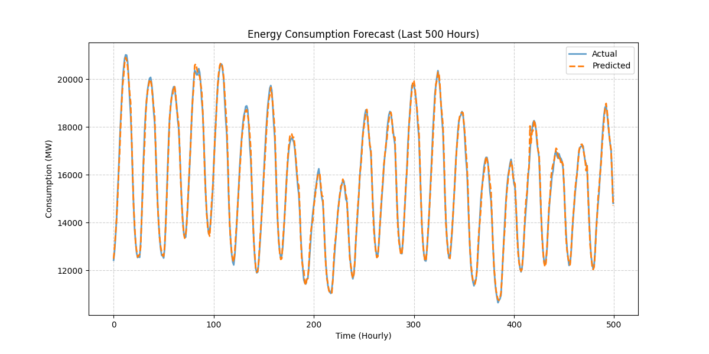
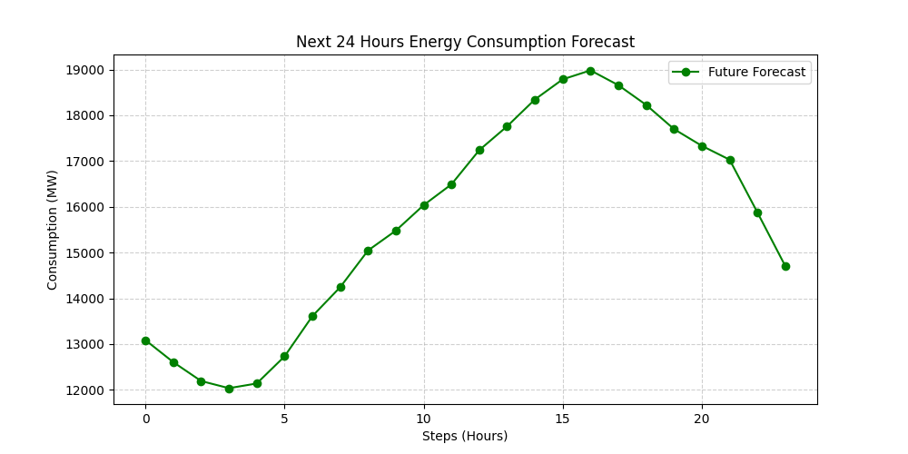

# ⚡ AI-Powered Energy Consumption Forecasting System

---

## 📌 Overview

This project is an **AI-based energy forecasting system** that predicts future electricity consumption using historical time-series data.

The system uses **machine learning models** to analyze past energy usage patterns and forecast future demand, helping simulate real-world energy optimization scenarios.

---

## 🎯 Problem Statement

Energy demand is highly dynamic and difficult to predict.

Without accurate forecasting:

* ⚠️ Energy is wasted
* ⚠️ Costs increase
* ⚠️ Power grids become unstable
* ⚠️ Peak demand causes overloads

This project solves the problem by:

* 📊 Predicting future energy consumption
* ⚡ Helping optimize energy distribution
* 💰 Reducing operational costs

---

## 🌍 Industry Relevance

Energy forecasting is widely used in:

* 🏙️ Smart Cities → optimize power usage
* ⚡ Electricity Boards → balance supply & demand
* 🏭 Manufacturing → reduce energy costs
* 🖥️ Data Centers → optimize cooling & power usage
* 🌱 Renewable Energy → match supply with demand

---

## 🧰 Tech Stack

* **Programming Language:** Python
* **Libraries:**

  * Pandas
  * NumPy
  * Matplotlib
  * Seaborn
  * Scikit-learn
  * Joblib

---

## 📊 Dataset

Dataset used:
**Hourly Energy Consumption Dataset (Kaggle)**

* Time-series data
* Hourly energy consumption (MW)
* Clean and structured format

---

## 🏗️ Architecture


---

## ⚙️ Installation

### 1. Clone Repository

```bash
git clone https://github.com/ShrutiBachal/Energy-Consumtion-Forecasting.git
cd Energy-Consumtion-Forecasting
```

### 2. Create Virtual Environment

```bash
python -m venv venv
venv\Scripts\activate   # Windows
```

### 3. Install Dependencies

```bash
pip install -r requirements.txt
```

---

## ▶️ Usage

Run the complete pipeline:

```bash
python main.py
```

---

## 🔄 Workflow

1. Load dataset
2. Preprocess data
3. Generate features (time + lag)
4. Train ML model (Random Forest)
5. Predict energy consumption
6. Evaluate performance
7. Visualize results

---

## 📈 Results

* ✔ Accurate energy consumption predictions
* ✔ RMSE and R² evaluation metrics
* ✔ Forecast for future energy demand

### 🔢 Sample Output

```
RMSE: 45.32  
R2 Score: 0.87  
```

---

## 📊 Visualizations

### 🔹 Actual vs Predicted



### 🔹 Future forecast



---

## 🧠 Learning Outcomes

Through this project, I learned:

* 📊 Time-series data handling
* 🧹 Data preprocessing techniques
* 🧠 Feature engineering (lag features, time features)
* 🤖 Machine learning model training
* 📉 Model evaluation (RMSE, R²)
* 📈 Data visualization
* 💼 Building industry-level ML pipelines
* 🚀 GitHub project structuring

---

## 🚀 Future Improvements

* 🔹 Add deep learning models (LSTM)
* 🔹 Deploy as web application
* 🔹 Integrate real-time data
* 🔹 Add dashboard using Streamlit

---

## 🙌 Conclusion

This project demonstrates how AI can be used to **predict energy demand**, enabling smarter energy management, cost optimization, and efficient resource utilization.

---

⭐ If you like this project, consider giving it a star!
